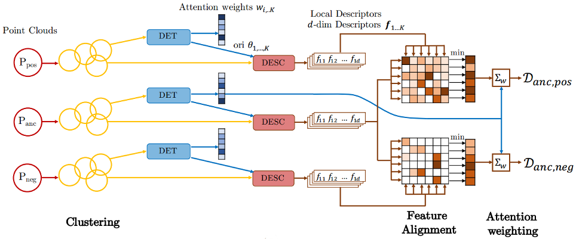

# 3DFeat-Net: Weakly Supervised Local 3D Features for Point Cloud Registration




## About

This work is based on our ECCV2018 paper. 3DFeat-Net is an approach for learning features for point cloud geometric registration under weak-supervision, where the supervision is given in terms of whether 2 point clouds have very high overlap or low (or no) overlap. For details, please read our paper which can be found on [arXiv](https://arxiv.org/abs/1807.09413).

Bibtex:

```
@inproceedings{yew2018-3dfeatnet, 
    title={3DFeat-Net: Weakly Supervised Local 3D Features for Point Cloud Registration}, 
    author={Yew, Zi Jian and Lee, Gim Hee}, 
    booktitle={ECCV},
    year={2018} 
}
```

## Environment

Our code is developed and tested on the following environment:

* Python 3.5
* Tensorflow 1.4 (with Cuda 8.0)
* Numpy 1.13.3
* Scikit-learn 0.19.1

We also use MATLAB scripts for evaluation and processing of data.

## Network

The network model is in `models/feat3dnet.py`.

### Prerequisites

Before using the model, you first need to compile the customized tf_ops in the folder `tf_ops` (we use the customized grouping and sampling ops from [PointNet++](https://github.com/charlesq34/pointnet2)). 

Check and execute `tf_xxx_compile.sh` under each subfolder. Update the python and nvcc file if necessary. The scripts has been updated for TF1.4, so if you're using TF version < 1.4, refer to the original script provided with PointNet++ for compilation.

### Training

#### Preparation of data

1. Follow instructions [here](scripts_data_processing/Readme.md#training-data) to download and prepare the training data
2. Also download the test data for descriptor matching (i.e. the 30,000 cluster pairs) by following the instructions [here](scripts_data_processing/Readme.md#test-data). We monitor the false alarm rate at 95% recall, as the training loss is not very informative (The provided script evaluates on all of the test data which can be slow; you can change this behavior by modifying VAL_PROPORTION in train.py)
3. Both the training and test sets should be placed in the same folder. The provided scripts assume they're placed in `../data/oxford`, which should contain two subfolders: `clusters` and `train`.

#### Training

Training is divided into 2 stages, where the first stage only trains the descriptor subnetwork without rotation and attention. For convenience, we provide a training script which runs both parts. Simply execute`./train.sh` (you can configure the top few lines to select the GPU, etc).

Training takes around 1-1.5 days to saturate. During training, progress can be monitored by running `tensorboard --logdir=./ckpt` from the root folder, and the false alarm rate will be shown in the fp_rate graph.

### Inference on Example data

1. Run `inference_example.sh` which will load the pretrained model in the folder `ckpt` and generate the keypoints and descriptors for the example data in `example_data`. A sample checkpoint can be downloaded from [here](https://drive.google.com/open?id=1JYZvFmMO3hgLN4ao3MqcMVgHYZtHhPOv). The output will be stored in `example_data/results`.
2. Run the MATLAB script `scripts/computeAndVisualizeMatches.m` which will match the features, estimate the relative transformation (with RANSAC) between the point clouds and display the results.

It should be straightforward to run on your own data, just make sure the data is in the expected format (see `scripts_data_processing/Readme.md`). Note however the following:

* z-axis should be pointing vertically upwards
* The network considers up to 64 points per cluster. For dense point clouds, it will pick the points randomly (as long the flag `--randomize_points` is set which will randomize the input point ordering). This means that the performance may differ slightly with each run.

## Datasets
Refer to [scripts_data_processing/Readme.md](scripts_data_processing/Readme.md).